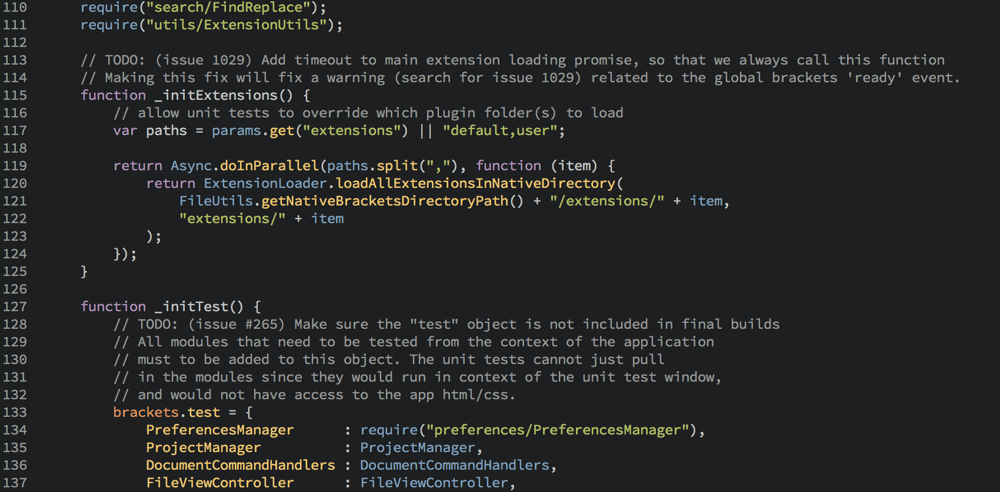
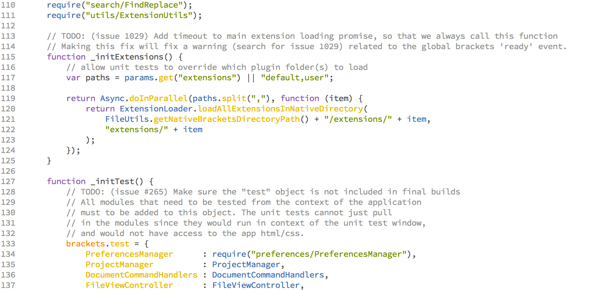
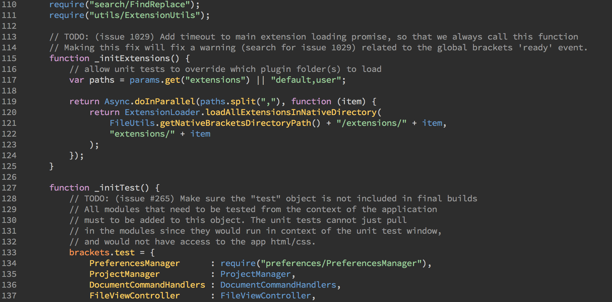
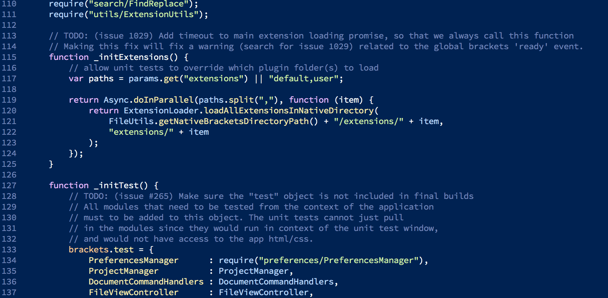
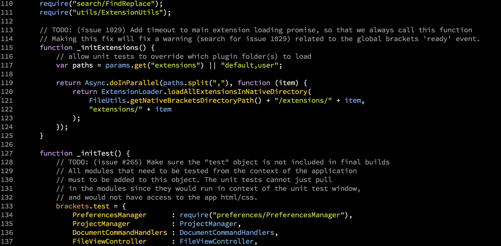

# Brackets Tomorrow Theme
This is the [Tomorrow Theme](https://github.com/ChrisKempson/Tomorrow-Theme/) for [Brackets](http://brackets.io) by [Ryan Stewart](http://blog.digitalbackcountry.com).

# Usage
Take these files and drop them into your `styles` directory in the Brackets source code. Then change line 56 of `styles/brackets_shared.less` and replace `brackets_theme_default.less` to whichever version of the Tomorrow theme you want to use.

# By

# Examples
## Tomorrow Night

## Tomorrow

## Tomorrow Night Eighties

## Tomorrow Night Blue

## Tomorrow Night Bright
