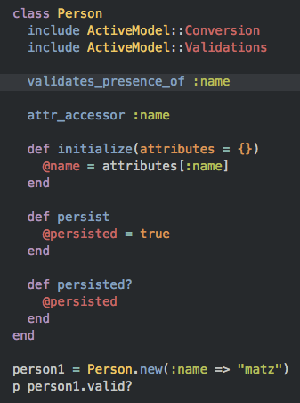
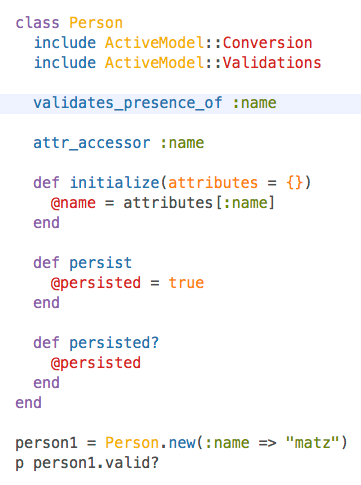
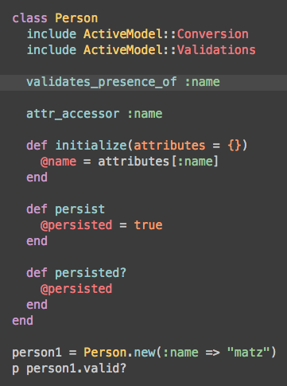
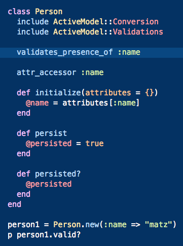
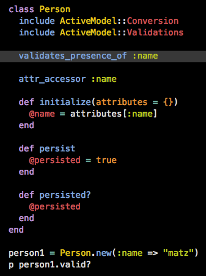
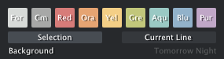
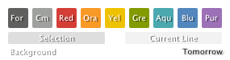
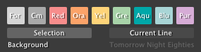
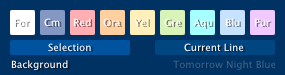
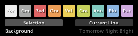

# Tomorrow Theme
After having spent over five years using, tweaking and refining a personal editor theme I decided it was time to release "Tomorrow Theme" - a bright theme with pastel colours and sensible syntax highlighting. 

A theme should aid your work by providing easily identifiable colours that add meaning and enhance legibility. This was the main focus when developing Tomorrow Theme.

## Take a look!

## Colour Palettes

### Tomorrow Night

### Tomorrow

### Tomorrow Night Eighties

### Tomorrow Night Blue

### Tomorrow Night Bright

